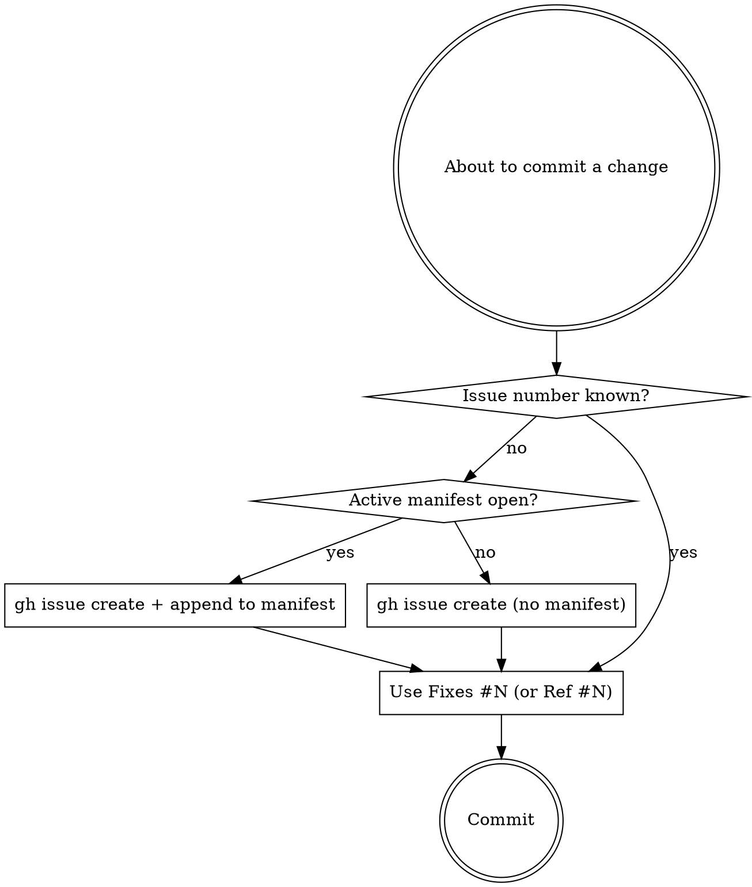

# Skill: GitHub Issue Workflow

## Overview
Create, track, and resolve GitHub issues in coordination with planning documents,
per-batch manifests, and git commits — so every change is traceable from plan
→ issue → commit.

**Core rule:** Never commit a fix without an associated issue. The paper trail
matters more than the speed.

## Quick Reference

| Situation | Commit trailer |
|---|---|
| Commit resolves an issue | `Fixes #N` (lowercase — GitHub auto-closes on merge to default) |
| Commit relates but doesn't resolve | `Ref #N` |
| Commit resolves several issues | `Fixes #12, fixes #14` |
| No issue exists yet for a fix | **Stop. File the issue first**, then commit with `Fixes #N` |

Valid commit types: `feat`, `fix`, `refactor`, `chore`, `docs`, `test`

Commit template:
```
<type>: <short description>

<body — what changed and why>

Plan: <relative path to plan doc, if one exists>
Fixes #<issue_number>
```

## Decision: Where Does the Issue Come From?



## Setup

### Prerequisites
- **GitHub CLI (`gh`)** must be installed and authenticated
  - Install: https://cli.github.com/
  - Authenticate: `gh auth login`
- **jq** is required (used by the Claude Code hook)

### Global Installation

This skill is installed globally at `~/.claude/skills/` and works across all
projects. The Claude Code hook is registered in `~/.claude/settings.json` and
automatically injects open-issue context when Claude is about to commit.

**Per-project setup** (run once in each repo that uses issue tracking):
1. Create the manifest directory:
```
   mkdir -p .claude/issues/archive
```
2. Seed the base labels:
```
   gh label create "bug" --color "d73a4a" --force
   gh label create "feature" --color "0075ca" --force
   gh label create "enhancement" --color "a2eeef" --force
   gh label create "chore" --color "e4e669" --force
   gh label create "documentation" --color "0e8a16" --force
```

### Optional: Git Hook (safety net for manual commits)

The Claude Code hook handles Claude-driven commits. If you also want warnings
on manual commits (outside Claude), set up the git hook per-project:
```
   mkdir -p .githooks
   cp ~/.claude/skills/claude-skills/issue-workflow/githooks/prepare-commit-msg .githooks/
   chmod +x .githooks/prepare-commit-msg
   git config core.hooksPath .githooks
```

### Optional CLAUDE.md Configuration
To override the default manifest directory, add to your CLAUDE.md:
```
issueManifestPath: your/custom/path
```
If not specified, defaults to `.claude/issues/`.

### Directory Structure
```
~/.claude/
  settings.json           (hooks config — PreToolUse for Bash)
  skills/
    issue-workflow/        (symlink to claude-skills/issue-workflow)
      SKILL.md
      hooks/
        pre-commit-issue-check.sh   (Claude Code hook — registered globally)
      githooks/
        prepare-commit-msg          (git hook — copied per-project if desired)

<project>/
  .claude/
    issues/
      archive/
      <date>-<slug>.json   (manifest files)
  .githooks/
    prepare-commit-msg     (optional, copied from skill)
```

## Configuration
- **Manifest directory:** Use the path specified in CLAUDE.md under
  `issueManifestPath`, defaulting to `.claude/issues/`
- **Archive directory:** `<manifest directory>/archive/`
- **Labels** are managed through this workflow — never assume a label exists

## Label Taxonomy
Before creating issues, ensure the following base labels exist. Use
`gh label create <name> --color <hex> --force` for each:

| Label           | Color   | Purpose                              |
|-----------------|---------|--------------------------------------|
| `bug`           | d73a4a  | Something broken                     |
| `feature`       | 0075ca  | New capability                       |
| `enhancement`   | a2eeef  | Improvement to existing capability   |
| `chore`         | e4e669  | Refactoring, CI, dependencies        |
| `documentation` | 0e8a16  | Documentation only                   |

Projects may define additional labels. Any label referenced in issue creation
MUST be verified or created before use.

## Workflow 1: Planned Work (From a Planning Doc)

### Step 1 — Generate Issues
When asked to create issues from a planning document:
1. Read the planning doc in full
2. Identify discrete units of work (each should be independently mergeable)
3. Classify each as `bug`, `feature`, `enhancement`, `chore`, or `documentation`
4. Present the proposed issues for review before proceeding — show title,
   body summary, labels, and type for each. Wait for confirmation.
5. Ensure all required labels exist in the repo (create if missing)
6. Create each issue via `gh issue create` with title, body, and labels
7. Generate a manifest file (see Manifest Schema below)
8. Commit the manifest to the repo

### Step 2 — Work Against the Manifest
When asked to work on issues from a manifest:
1. Read the active manifest to understand the current batch
2. Identify the next open issue (or the specific issue requested)
3. Hold the active issue number — this will be used in the commit message
4. Do the work: implement the change and write/update tests
5. When the work is code-complete and tests pass, commit using:
```
   <type>: <short description>

   <body — what changed and why>

   Plan: <relative path to plan doc, if one exists>
   Fixes #<issue_number>
```
6. Update the issue's `status` in the manifest to `"closed"`
7. Commit the manifest update

When multiple issues remain, repeat from step 2 for the next open issue.

### Step 3 — Commit Message Format

**Completion commits** (issue fully resolved, code and tests passing):
```
<type>: <short description>

<body — what changed and why>

Plan: <relative path to plan doc, if one exists>
Fixes #<issue_number>
```

If a commit addresses multiple issues:
```
<type>: <short description>

<body>

Plan: plans/auth-refactor.md
Fixes #12, fixes #14
```

**Reference commits** (related to an issue but not resolving it):
```
<type>: <short description>

<body — what changed and why>

Ref #<issue_number>
```

Rules:
- Use `Fixes #N` when the issue is fully resolved
- Use `Ref #N` when the commit is related but does not resolve the issue
- If there is no associated plan doc, omit the `Plan:` line
- Use lowercase `fixes` — GitHub recognizes it and will auto-close
  issues on merge to the default branch

Valid types: `feat`, `fix`, `refactor`, `chore`, `docs`, `test`

### Step 4 — Archive the Manifest
After committing work that resolves an issue:
1. Update the issue's `status` in the manifest to `"closed"`
2. When all issues in a manifest are closed, move the manifest
   to the archive directory with its date-prefixed filename

## Workflow 2: Ad Hoc Fixes

When asked to fix something with a known issue number:
1. Read the manifest (if one exists) to check for context
2. Hold the issue number for use in the commit message
3. Make the fix
4. Commit with `Fixes #<number>` in the message

When asked to fix something with NO issue number:
1. Create an issue first via `gh issue create` with appropriate labels
2. Note the returned issue number
3. Hold the issue number for use in the commit message
4. Make the fix
5. Commit with `Fixes #<number>` in the message
6. If an active manifest exists, append the new issue to it

Never commit a fix without an associated issue. The paper trail matters.

## Manifest Schema

Filename: `<date>-<slug>.json` (e.g., `2025-02-27-auth-refactor.json`)
```json
{
  "created": "YYYY-MM-DD",
  "plan_doc": "relative path to the source planning document, or null",
  "issues": [
    {
      "number": 12,
      "title": "Short issue title",
      "status": "open | closed",
      "labels": ["feature", "auth"],
      "type": "feat | fix | refactor | chore | docs | test"
    }
  ]
}
```

### Manifest Rules
- One active manifest per batch of work
- Multiple active manifests may coexist (e.g., different feature tracks)
- The manifest is committed to the repo and kept up to date
- Archived manifests are never deleted — they serve as history

## Common Mistakes

| Mistake | Why it's wrong | Fix |
|---|---|---|
| Committed a fix without filing an issue | Breaks the paper trail; future blame/`git log` can't reach the why | File via `gh issue create` first, then commit with `Fixes #N` |
| Used `Closes #N` or `Resolves #N` instead of `Fixes #N` | GitHub recognises all three, but this workflow standardises on `Fixes` for grep-ability and to match the manifest tooling | Use `Fixes` |
| Capitalised `Fixes` in the trailer | Hooks and downstream regex assume lowercase; capitalised forms slip past linters that grep for `fixes #` | Lowercase |
| Created an issue with a label that doesn't exist | `gh issue create --label` fails silently for the missing label and the issue gets filed with the wrong tags | Verify the label exists (or create it) before passing `--label` |
| Archived a manifest with open issues remaining | Loses the active work pointer; the manifest dir scan finds nothing to nag about | Only archive once **all** issues in the manifest are `closed` |
| Updated a manifest entry to `closed` but the linked PR hasn't merged | Manifest now lies about repo state | Mark `closed` only after the commit that says `Fixes #N` is on the default branch |
| Filed an issue without holding the returned number for the upcoming commit | You'll forget which number to cite, then commit without a trailer | After `gh issue create`, capture the number immediately and use it in the very next commit |

## Red Flags — Stop Before Committing

- About to type `git commit` with no `#` reference in the message
- About to mark a manifest issue `closed` without a corresponding `Fixes #N` commit
- About to archive a manifest with at least one `"status": "open"` entry
- About to call `gh issue create --label <x>` without verifying `x` exists in `gh label list`

Any of these → stop, do the prerequisite step, then proceed.

## Error Handling
- If `gh` is not authenticated, stop and instruct the user to run `gh auth login`
- If a label creation fails, stop and report — do not create issues with missing labels
- If issue creation fails, report the failure and do not update the manifest
- If the `.claude/issues/` directory does not exist in the project, create it
  before writing a manifest