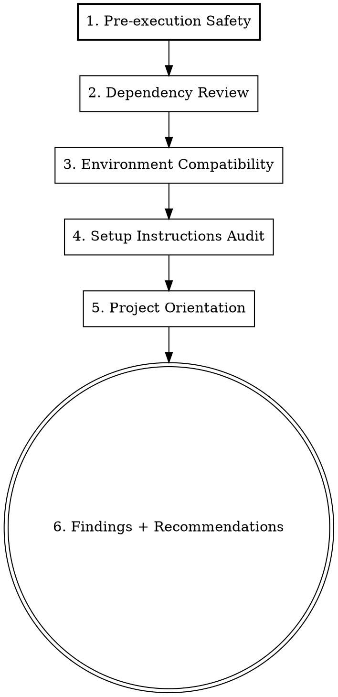

# Project Audit

## Overview

Systematic security and orientation audit for unfamiliar codebases. Run BEFORE any install, build, or setup commands. The goal: determine if it's safe to proceed, whether setup will work in this environment, and what you need to know.

**Core principle:** Never run code you haven't audited. Install commands execute arbitrary code.

## When to Use

- Just cloned/checked out a new project
- Opening an unfamiliar codebase for the first time
- User asks "is this safe?", "can I run this?", "what is this project?"
- No `.claude/` project directory exists (fresh clone signal)

**When NOT to use:** Projects you've already audited in a previous session, unless major changes occurred.

## Audit Checklist

Work through ALL sections in order. Do NOT skip sections. Use subagents for parallel research where sections are independent.



### 1. Pre-execution Safety Scan

This is the most critical section. Check ALL of these before ANY install/build command:

**Package manager hooks (MUST CHECK):**
- **Node.js**: `package.json` lifecycle scripts (`preinstall`, `postinstall`, `prepare`, `prebuild`). `.npmrc` / `.yarnrc` / `.pnpmrc` for custom `registry` URLs (supply chain vector). Lockfile: search for `hasInstallScript` in transitive deps
- **Python**: `setup.py` (arbitrary code runs on `pip install`), `pyproject.toml` build scripts, `Makefile` targets
- **Rust**: `build.rs` (runs at compile time), `proc-macro` crates
- **Go**: `go generate` directives, CGO compilation flags
- **General**: any `postinstall`/`prepare`/`setup` hook in any ecosystem

**Git hooks (MUST CHECK ALL, not just .husky):**
- `.husky/` directory
- `.git/hooks/` (non-sample files)
- `lefthook.yml` / `.lefthook.yml`
- `.pre-commit-config.yaml`
- `lint-staged` config in `package.json` or `.lintstagedrc`
- `simple-git-hooks` in `package.json`

**Build tool plugins (MUST CHECK):**
- `vite.config.*` / `webpack.config.*` / `rollup.config.*` — plugins execute arbitrary code during build
- Custom babel/SWC/PostCSS plugins
- Any config that imports from non-standard packages

**Executable scripts (MUST CHECK):**
- `Makefile`, `setup.sh`, `install.sh`, `bootstrap.sh`, `init.sh`, `justfile`
- `scripts/` directory — read contents of each script
- Docker: `Dockerfile`, `docker-compose.yml`, `.devcontainer/`
- CI/CD: `.github/workflows/`, `.gitlab-ci.yml`, `.circleci/`

**Credential exposure scan:**
- Search source files for patterns: API keys, tokens, passwords, secrets
- Check for `.env` files that shouldn't be committed
- Look for hardcoded URLs with embedded credentials
- Verify `.gitignore` excludes sensitive files (`.env`, `*.pem`, `credentials.*`)

**For each finding, classify as:**
- **SAFE** — standard, expected, no concerns
- **REVIEW** — unusual but not necessarily dangerous, explain what it does
- **WARNING** — potentially dangerous, explain the risk

### 2. Dependency Review

First identify the ecosystem(s): look for `package.json`, `pyproject.toml`/`requirements.txt`, `Cargo.toml`, `go.mod`, `Gemfile`, etc.

- Count total dependencies (direct + dev)
- Flag unusual or unfamiliar packages — check if names look like typosquats of popular packages
- Note packages with very few downloads or recent creation (if determinable)
- Check version pinning strategy (exact vs range vs latest)
- Flag any dependencies with their own install scripts (Node: search lockfile for `hasInstallScript`; Python: check `setup.py` in deps)

### 3. Environment Compatibility

Detect the current environment, then compare against project requirements:

**Detect:**
- OS, architecture
- Available runtimes (Node, Python, Ruby, Go, Rust, Java, etc.)
- Package managers available
- Docker availability

**Compare against:**
- `engines` field in `package.json`
- `.nvmrc`, `.node-version`, `.python-version`, `.tool-versions`
- `Dockerfile` base image (implies required runtime)
- README stated requirements

**Present as a compatibility matrix:**

```
| Requirement      | Needed   | Available | Status |
|-----------------|----------|-----------|--------|
| Node.js         | >= 18    | v22.18.0  | OK     |
| pnpm            | >= 8     | 10.30.3   | OK     |
```

Flag any incompatibilities or missing tools.

### 4. Setup Instructions Audit

- Locate README, CONTRIBUTING.md, docs/ directory
- Walk through each setup step — identify:
  - **Missing steps** (e.g., "run migrations" but no migration command shown)
  - **Assumed knowledge** (e.g., assumes you know how to configure Keycloak)
  - **Missing env vars** (referenced in code but not documented)
  - **External service dependencies** (databases, auth providers, APIs, SaaS)
  - **Unclear ordering** (which steps depend on others?)
- Check for `.env.example` or similar templates
- Note if any step requires credentials or access you might not have

### 5. Project Orientation

Provide a concise orientation:

- **Tech stack** — frameworks, languages, key libraries
- **Architecture pattern** — monolith, microservices, SPA, SSR, CLI, library
- **Key directories** — what lives where (3-8 most important)
- **Entry points** — main files, dev server commands, CLI entry
- **Data persistence** — databases, file storage, caches
- **External integrations** — APIs, auth providers, third-party services
- **Dev workflow** — available scripts, test commands, linting
- **Known limitations** — stubs, TODOs, deprecated sections

### 6. Findings and Recommendations

Present findings in priority order:

**Blockers** — Must resolve before running install/build:
- Security issues found
- Missing required tools
- Incompatible environment

**Warnings** — Review before proceeding:
- Unusual scripts that will execute
- Missing documentation
- Hardcoded credentials or config

**Notes** — Good to know:
- Architecture decisions
- Development workflow tips
- Things that might surprise you

**Recommended next steps** — Ordered list of what to do:
1. Address any blockers
2. Install dependencies (if safe)
3. Specific setup steps in order
4. How to verify it's working

## Common Mistakes

| Mistake | Why it matters |
|---------|---------------|
| Only checking `.husky/` for git hooks | Projects use lefthook, pre-commit, simple-git-hooks, or raw `.git/hooks/` |
| Only checking root `package.json` for install scripts | Transitive dependencies can have `postinstall` hooks too |
| Ignoring build tool configs | Vite/webpack plugins execute arbitrary code during build |
| Not reading scripts in `scripts/` directory | These are often run manually but could contain anything |
| Skipping `.npmrc` registry check | Custom registries are a supply chain attack vector |
| Saying "looks safe" without checking all items | The checklist exists because humans skip things. Follow it. |
| Not checking for committed secrets | `.env` in `.gitignore` doesn't mean secrets aren't elsewhere |

## Red Flags — Investigate Before Proceeding

If you see ANY of these, flag them prominently:

- `postinstall` script that runs something other than a known build tool
- Custom npm/yarn registry URL in `.npmrc`
- Obfuscated or minified source code in the repo
- Dependencies with names very similar to popular packages (typosquatting)
- `eval()`, `Function()`, or `child_process.exec()` in install/build scripts
- Git hooks that download or execute remote code
- `.env` files committed to the repo with real credentials
- Build configs importing from unusual or misspelled packages
